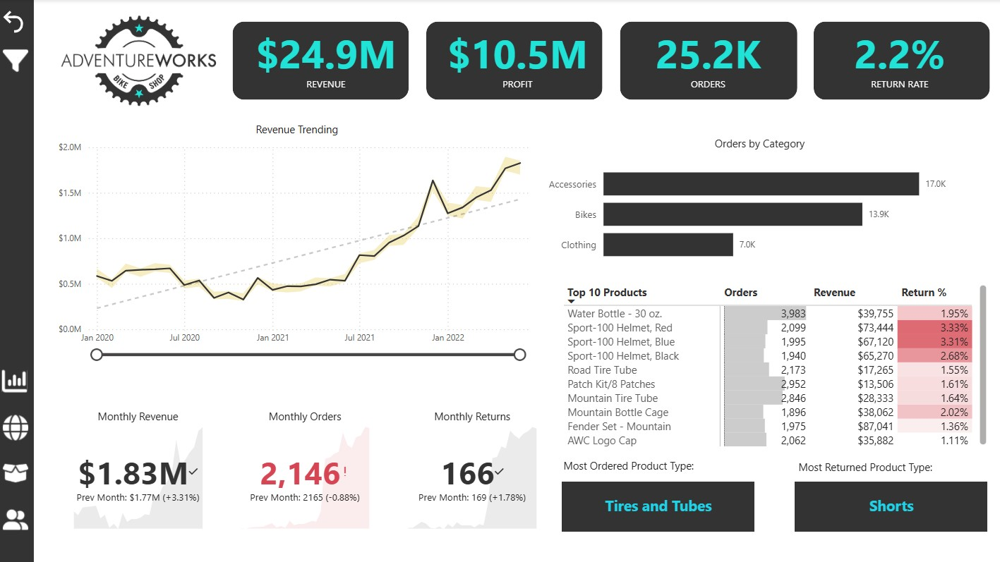
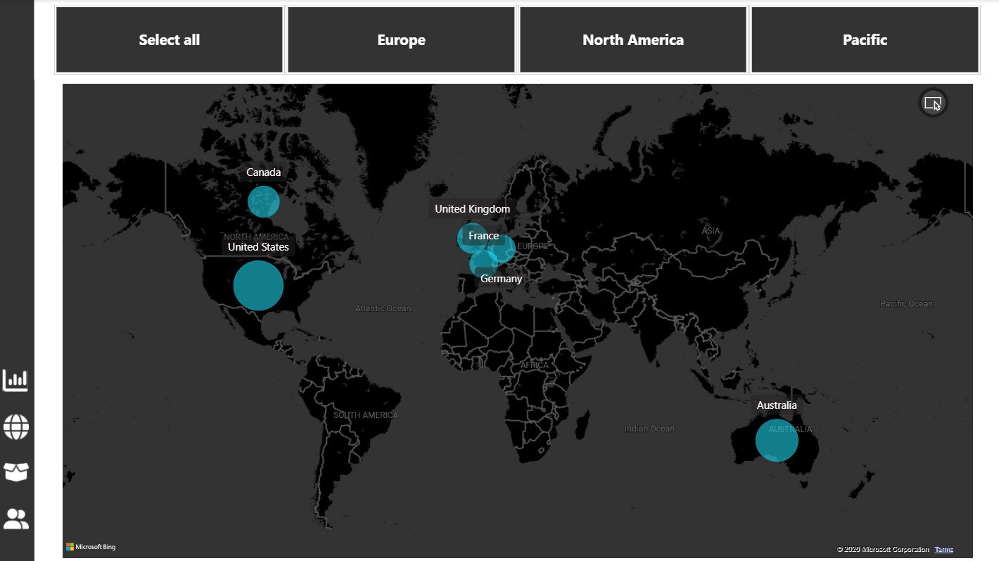
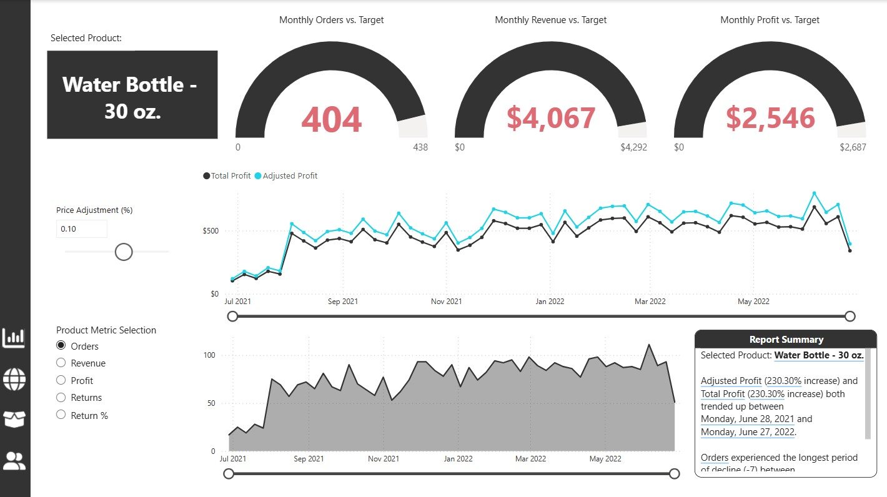
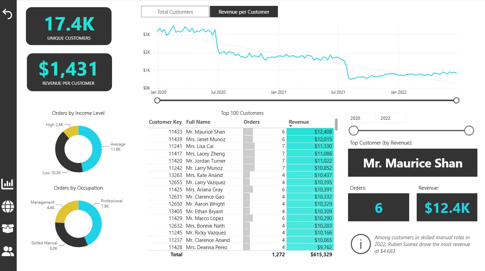
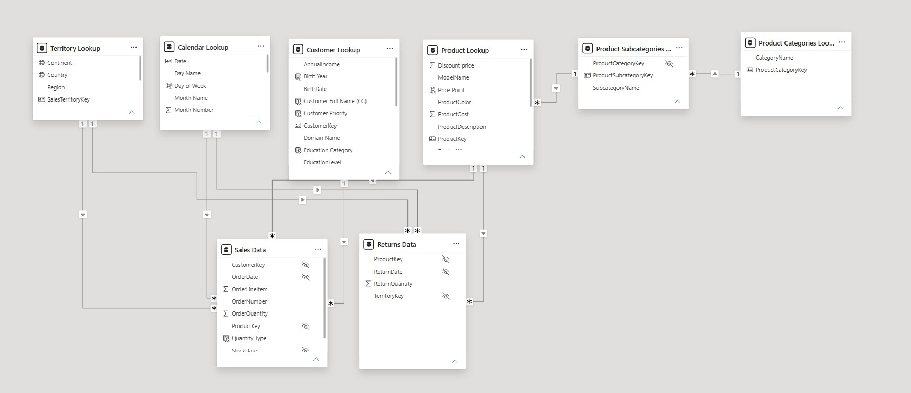

# AdventureWorks Sales Report 🚲
### Microsoft Power BI Desktop | Maven Analytics Course Project

> A fully interactive Power BI report built on the fictional AdventureWorks Bike Shop dataset, developed throughout the **Microsoft Power BI Desktop** course by [Maven Analytics](https://www.mavenanalytics.io/). This project covers the end-to-end BI workflow - from raw data ingestion to a polished, multi-page executive report.

---

## 📋 Table of Contents

- [Project Overview](#project-overview)
- [Report Screenshots](#report-screenshots)
- [Part 1 - Connecting & Shaping Data](#part-1---connecting--shaping-data)
- [Part 2 - Data Modeling](#part-2---data-modeling)
- [Part 3 - Calculated Fields with DAX](#part-3---calculated-fields-with-dax)
- [Part 4 - Visualizing Data with Reports](#part-4---visualizing-data-with-reports)
- [Key Learnings](#key-learnings)
- [Tools & Technologies](#tools--technologies)
- [Course Credit](#course-credit)

---

## Project Overview

AdventureWorks is a fictional global bicycle retailer. The dataset spans sales transactions, product returns, customers, territories, and a product catalog across multiple regions (North America, Europe, and Pacific).

The goal of this project was to transform raw CSV files into a professional-grade Power BI report that answers key business questions:

- How is revenue and profit trending over time?
- Which products are driving the most orders and returns?
- Who are the top customers and how are they segmented?
- How does performance compare against monthly targets?

The finished report consists of **4 pages**: an **Executive Dashboard**, a geographic **Map**, a **Product Detail** page and a **Customer Detail** view.

---

## Report Screenshots

### Executive Dashboard


### Map


### Product Detail


### Customer Detail


---

## Part 1 - Connecting & Shaping Data

The first stage of the project was about connecting to the raw data and preparing it for analysis using **Power Query Editor**.

### Data Sources

All source files were flat CSV files, loaded into Power BI via the **Get Data → Text/CSV** connector. The following tables were imported:

| Table | Type | Description |
|---|---|---|
| Sales Data | Fact | Individual order line items |
| Returns Data | Fact | Product return records |
| Customer Lookup | Dimension | Customer demographic info |
| Product Lookup | Dimension | Product names, prices, and costs |
| Product Subcategories Lookup | Dimension | Subcategory groupings |
| Product Categories Lookup | Dimension | Top-level category groupings |
| Territory Lookup | Dimension | Sales regions and geographies |
| Calendar Lookup | Dimension | Date table for time intelligence |

### Power Query Transformations

Inside the Power Query Editor, the following shaping steps were applied across the tables:

- **Header promotion**: ensured that the first row of data is used as the header for better clarity.
- **Changing data types**: assigning correct types (date, integer, decimal, text) to each column to avoid implicit conversion issues
- **Renaming columns**: standardizing column names for clarity and consistency across tables
- **Calculated columns**: added new calculated fields to facilitate deeper insights
- **Data trimming**: removed unnecessary whitespace from the dataset for cleaner data presentation
- **Removal of unwanted columns and duplicates**: cleared out irrelevant columns and eliminated duplicate entries to refine the dataset


> 💡 **What I learned:** Power Query is where **data quality** is established. Investing time here (cleaning types, removing noise, standardizing keys) pays dividends in the modeling and DAX stages. A small inconsistency in a key column can silently break relationships and produce wrong numbers in your visuals.

---

## Part 2 - Data Modeling

With clean data loaded, the next step was designing the **data model** — defining how tables relate to each other and structuring it for optimal DAX performance.

### Schema Design

The model was designed with a **downward filter flow** to ensure a seamless connection between fact tables and dimension tables. The overall architecture combines two schema patterns:

- A **Star Schema** governs the main structure — each fact table sits at the center and is directly connected to its surrounding dimension tables
- A **Snowflake Schema** is used within the product hierarchy, where `Product Categories Lookup` → `Product Subcategories Lookup` → `Product Lookup` are chained in a normalized, multi-level structure

Relationships between all tables are based on **primary and foreign keys**, with **one-to-many cardinality** and a **single cross-filter direction** throughout. To keep the model clean and user-friendly, primary keys were designated as the key column, and all foreign keys were hidden from the report view.

The model contains:

- **2 Fact Tables**: `Sales Data` and `Returns Data` — these hold the transactional records (orders, quantities, dates, keys)
- **6 Dimension/Lookup Tables**: `Customer Lookup`, `Product Lookup`, `Product Subcategories Lookup`, `Product Categories Lookup`, `Territory Lookup`, `Calendar Lookup` — these hold descriptive attributes used to slice and filter the facts




### Relationships

All relationships were created manually in the **Model View**. Key decisions made:

- All relationships are **one-to-many** from dimension to fact (one customer → many orders)
- **Single-direction filters** were used throughout to avoid ambiguity and circular dependency risks


> 💡 **What I learned:** The Star Schema isn't just a design preference — it's a performance choice. Flat, denormalized tables feel intuitive but force Power BI to work harder. Separating facts from dimensions and keeping relationships clean makes DAX filters propagate correctly and keeps model performance fast.

---

## Part 3 - Calculated Fields with DAX

DAX (Data Analysis Expressions) is the formula language used in Power BI to create **measures** and **calculated columns**. All measures in this project are stored in the dedicated `Measure Table`.

### Core Aggregations

The foundation of the report — basic totals that power most visuals.

```dax
Total Revenue = 
SUMX(
    'Sales Data',
    'Sales Data'[OrderQuantity] * RELATED('Product Lookup'[ProductPrice])
)
```

```dax
Total Cost = 
SUMX(
    'Sales Data',
    'Sales Data'[OrderQuantity] * RELATED('Product Lookup'[ProductCost])
)
```

```dax
Total Profit = [Total Revenue] - [Total Cost]
```

```dax
Total Orders = 
DISTINCTCOUNT('Sales Data'[OrderNumber])
```

```dax
Total Returns = 
COUNT('Returns Data'[ReturnQuantity])
```

```dax
Total Customers = 
DISTINCTCOUNT('Sales Data'[CustomerKey])
```

> `SUMX` is used instead of `SUM` because revenue must be calculated **row by row** (quantity × price per product), then summed — a classic iterator pattern.

---

### Ratio & Rate Measures

```dax
Return Rate = 
DIVIDE([Quantity Returned], [Quantity Sold], "No Sales")
```

```dax
% of All Orders = 
DIVIDE([Total Orders], [All Orders])
```

```dax
Average Revenue per Customer = 
DIVIDE([Total Revenue], [Total Customers])
```

> `DIVIDE()` is always preferred over the `/` operator — it handles division-by-zero gracefully by returning a fallback value instead of an error.

---

### Time Intelligence

These measures require the Calendar table to be correctly marked as a date table.

```dax
Previous Month Revenue = 
CALCULATE(
    [Total Revenue],
    DATEADD('Calendar Lookup'[Date], -1, MONTH)
)
```

```dax
YTD Revenue = 
CALCULATE(
    [Total Revenue],
    DATESYTD('Calendar Lookup'[Date])
)
```

```dax
10-day Rolling Revenue = 
CALCULATE(
    [Total Revenue],
    DATESINPERIOD(
        'Calendar Lookup'[Date],
        MAX('Calendar Lookup'[Date]),
        -10,
        DAY
    )
)
```

```dax
90-day Rolling Profit = 
CALCULATE(
    [Total Profit],
    DATESINPERIOD(
        'Calendar Lookup'[Date],
        MAX('Calendar Lookup'[Date]),
        -90,
        DAY
    )
)
```

---

### Target & Gap Measures

Monthly targets are set at 10% above the previous month's actuals, and gap measures show how far above or below target the current month sits.

```dax
Revenue Target = [Previous Month Revenue] * 1.1

Revenue Target Gap = [Total Revenue] - [Revenue Target]
```

```dax
Order Target = [Previous Month Orders] * 1.1

Order Target Gap = [Total Orders] - [Order Target]
```

```dax
Profit Target = [Previous Month Profit] * 1.1

Profit Target Gap = [Total Profit] - [Profit Target]
```

---

### What-If & Scenario Analysis

A **Price Adjustment (%)** parameter was created to allow dynamic scenario modeling — users can drag a slider to simulate the impact of price changes on profit.

```dax
Adjusted Price = 
[Average Retail Price] * (1 + 'Price Adjustment (%)'[Price Adjustment (%) Value])
```

```dax
Adjusted Revenue = 
SUMX(
    'Sales Data',
    'Sales Data'[OrderQuantity] * [Adjusted Price]
)
```

```dax
Adjusted Profit = [Adjusted Revenue] - [Total Cost]
```

---

### Context-Aware Measures

Some measures behave differently depending on the filter context — for example, on the Customer Detail page, they show a single value when one customer is selected, or a dash otherwise.

```dax
Full Name (Customer Detail) = 
IF(
    HASONEVALUE('Customer Lookup'[CustomerKey]),
    MAX('Customer Lookup'[Full Name]),
    "Multiple Customers"
)
```

```dax
Total Revenue (Customer Detail) = 
IF(
    HASONEVALUE('Customer Lookup'[CustomerKey]),
    [Total Revenue],
    "-"
)
```

---

### Other Notable Measures

```dax
High Ticket Orders = 
CALCULATE(
    [Total Orders],
    FILTER(
        'Product Lookup',
        'Product Lookup'[ProductPrice] > [Overall Average Price]
    )
)
```

```dax
Weekend Orders = 
CALCULATE(
    [Total Orders],
    'Calendar Lookup'[Weekend] = "Weekend"
)
```

```dax
Bike Return Rate = 
CALCULATE(
    [Return Rate],
    'Product Categories Lookup'[CategoryName] = "Bikes"
)
```

> 💡 **What I learned:** DAX is fundamentally about understanding **filter context** — knowing what filters are active when a measure evaluates. `CALCULATE` is the engine of almost everything: it lets you override or modify the current filter context. Once that clicked, building measures became much more intuitive.

---

## Part 4 - Visualizing Data with Reports

The report was built across 4 pages, each serving a distinct analytical purpose. A consistent dark theme with teal accent colors was applied throughout.

---

### Page 1 - Executive Dashboard

The top-level summary page. Designed for a business stakeholder who needs a quick pulse on the business.

**Visuals included:**
- **4 KPI cards** at the top
- **Revenue Trending** line chart with a forecast/trend line overlay
- **Orders by Category** horizontal bar chart
- **Top 10 Products** matrix showing Orders, Revenue, and Return % with conditional formatting
- **Monthly KPI cards** with sparklines and month-over-month % change (Revenue, Orders, Returns)
- **Most Ordered** and **Most Returned** product type highlight cards

---

### Page 2 - Map

A geographic sales distribution view using the **ArcGIS / Bing Map** visual.

**Features:**
- Bubble map sized by order volume across 6 countries: United States, Canada, United Kingdom, France, Germany, Australia
- **Region filter buttons** for quick continental filtering: Select All / Europe / North America / Pacific

---

### Page 3 - Product Detail

A drill-through page — accessible by right-clicking a product on the Executive Dashboard. Designed for deep-diving into a single product's performance.

**Features:**
- Selected product display card (e.g. "Water Bottle - 30 oz.")
- **3 gauge charts** comparing current month vs. target
- **Price Adjustment slider** — a What-If parameter that dynamically recalculates Adjusted Profit vs Total Profit on a dual-line chart
- **Product Metric Selection** radio buttons (Orders / Revenue / Profit / Returns / Return %) that dynamically swap the area chart next to it
- **AI-powered Report Summary** panel using the Smart Narrative visual

---

### Page 4 - Customer Detail

A customer-focused analytics page with segmentation and top-customer identification.

**Features:**
- **KPI cards**
- Toggle button to switch the trend line between **Total Customers** and **Revenue per Customer** over time
- **Orders by Income Level** donut chart (High / Average / Low)
- **Orders by Occupation** donut chart (Management, Professional, Skilled Manual, etc.)
- **Top 100 Customers** matrix with Orders and Revenue, sortable
- **Top Customer card** dynamically updating based on filters
- **Smart Narrative** insight surfacing contextual anomalies

---

### Design Decisions

- A **dedicated navigation sidebar** with icon buttons was built for page-to-page navigation, replacing the default Power BI tab bar
- **Conditional formatting** was applied to the Top 10 Products matrix — Return % values above a threshold are highlighted in red
- **Bookmarks** were used on the Customer Detail page to toggle between the two trend line views
- All measures were stored in a **separate Measure Table** to keep the field list clean

> 💡 **What I learned:** Visualization is where all the prior work pays off — but it also exposes any gaps. Slicers that don't filter as expected, visuals that show blank, measures that return the wrong number in a matrix context — debugging these taught me more about DAX filter context than any exercise did. The design side also matters more than I expected: a clean layout, consistent colors, and good visual hierarchy make a report feel trustworthy.

---

## Key Learnings

This project reinforced several principles that I'll carry into future BI work:

1. **Data quality is set in Power Query.** Spending time cleaning and shaping data before it hits the model avoids a cascade of problems later.
2. **Star schema is non-negotiable.** It's not just best practice — it's the architecture Power BI's DAX engine is optimized for.
3. **CALCULATE is the heart of DAX.** Almost every interesting measure involves modifying filter context, and `CALCULATE` is the tool for that.
4. **Iteration over aggregation (SUMX vs SUM).** When a calculation needs to happen at the row level before summing, `SUMX` is the right choice.

---

## Tools & Technologies

- **Power BI Desktop** 
- **Power Query** — data connection and transformation
- **DAX (Data Analysis Expressions)** — calculated measures and columns
- **Microsoft Bing Maps** — geographic visualizations
- **Power BI AI Visuals** — Smart Narrative

---

## Course Credit

This project was built as part of the **Microsoft Power BI Desktop** course by [Maven Analytics](https://www.mavenanalytics.io/).

The AdventureWorks dataset is a fictional dataset used for learning and demonstration purposes.
